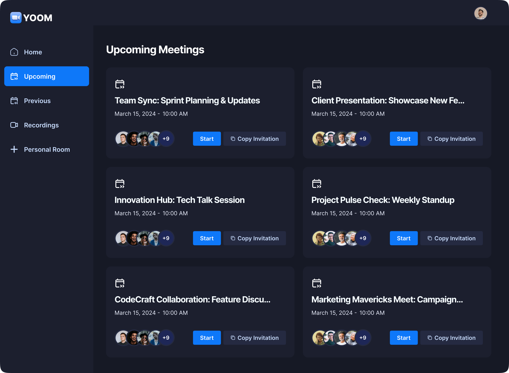

<h3 align="center">A Zoom Clone</h3>

     Built with the latest Next.js and TypeScript, this project replicates Zoom, a widely used video conferencing tool. It enables users to securely log in, create meetings and access various meeting functionalities such as recording, screen sharing, and managing participants.

## ⚙️ Tech Stack

- <a href="https://nextjs.org/" target="_blank"> Next.js </a>
- <a href="https://www.typescriptlang.org/" target="_blank"> TypeScript </a>
- <a href="https://clerk.com/" target="_blank"> Clerk </a>
- <a href="https://getstream.io/" target="_blank"> getstream </a>
- <a href="https://ui.shadcn.com/" target="_blank"> shadcn </a>
- <a href="https://tailwindcss.com/" target="_blank"> Tailwind CSS </a>

## 🔋 Features

**Authentication**: Implements authentication and authorization features using Clerk, allowing users to securely log in via social sign-on or traditional email and password methods, while ensuring appropriate access levels and permissions within the platform.

**New Meeting**: Quickly start a new meeting, configuring camera and microphone settings before joining.

**Meeting Controls**: Participants have full control over meeting aspects, including recording, emoji reactions, screen sharing, muting/unmuting, sound adjustments, grid layout, participant list view, and individual participant management (pinning, muting, unmuting, blocking, allowing video share).

**Exit Meeting**: Participants can leave a meeting, or creators can end it for all attendees.

**Schedule Future Meetings**: Input meeting details (date, time) to schedule future meetings, accessible on the 'Upcoming Meetings' page for sharing the link or immediate start.

**Past Meetings List**: Access a list of previously held meetings, including details and metadata.

**View Recorded Meetings**: Access recordings of past meetings for review or reference.

**Personal Room**: Users have a personal room with a unique meeting link for instant meetings, shareable with others.

**Join Meetings via Link**: Easily join meetings created by others by providing a link.

**Secure Real-time Functionality**: All interactions within the platform are secure and occur in real-time, maintaining user privacy and data integrity.

**Responsive Design**: Follows responsive design principles to ensure optimal user experience across devices, adapting seamlessly to different screen sizes and resolutions.

## 😍 Images

<h1>Auth Page</h1>

<h1>Home Page</h1>

<h1>Modal Create Meeting Page</h1>

<h1>Modal Success Page</h1>

<h1>Upcoming Meetings Page</h1>

<h1>Previous Meetings Page</h1>

<h1>Recordings Page</h1>

<h1>Personal Room Page</h1>

